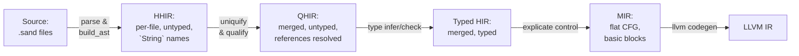

# the `sand` language & compiler implementation

a compiler for a small statically-typed expression language, structured as a sequence of IR transformations from parsed source to LLVM IR.

## usage

1. [install rust](https://rust-lang.org/tools/install/)
2. clone & cd in the repo
3. `cargo build` to compile the compiler & all utilities

now you have the 2 main binaries: `target/debug/sand-cli` and `target/debug/sand-lsp`, as well as 

### `sand-cli`
use it to compile `.sand` files to executables:
```sh
sand-cli compile <path-to-file.sand> --output <output-file>
```
or multiple files at once:
```sh
sand-cli compile <path-to-file.sand> <path-to-other-file.sand> ...
```
dump the AST to stdout:
```sh
sand-cli compile <path-to-file.sand> --print-ast
```
or emit LLVM IR:
```sh
sand-cli compile <path-to-file.sand> --emit-llvm
```

for projects with multiple files, a `sand.toml` can be used to group them together:
```toml
[project]
name = "my-project"
sources = [
    "src/",
    "main.sand"
]
```

<details><summary>sand-lsp</summary>
unfortunately most IDEs nowdays do not support custom LSPs easily, and instead require a plugin or extension to be installed (which doesnt exist for sand).

however if you're using vim/nvim, you can add the lsp with:
```lua
vim.filetype.add({
    extension = {
        sand = "sand",
    },
})

vim.lsp.config["sand"] = {
    cmd = { "/path/to/sand-lsp" },
    filetypes = { "sand" },
    root_markers = { "sand.toml" },
}

vim.lsp.enable("sand")
```
</details>

## the language

Sand is expression-oriented and statically typed. Every construct is an expression with a type.

```sand
def fib(n: Int): Int :=
  if n ≤ 1 then n else fib(n - 1) + fib(n - 2)

def main(): Int := {
    let mut x = 10;
    x = fib(x);
    println(x);
    0
}
```

its grammar is defined in [`grammar.pest`](grammar.pest), and the parser is autogenerated by [`pest`](https://pest.rs/).

### types
`Int`, `Bool`, `Unit`, user-defined enums (`type Ordering := Lt | Eq | Gt`), [OCaml-style polymorphic variants](hhttps://ocaml.org/manual/5.4/polyvariant.html) (without subtyping):
```sand
def check(x: Int): #one | #two | #other :=
    if x < 0 then #one else if x > 0 then #two else #other
```

### blocks
`{ (stmt;)* expr? }`
statements are executed in order, 
the final expression is the block's value; omitting it gives `Unit`.
```
Statement ::=
  | Declaration ("let" "mut"? identifier (":" type)? "=" expr ";")
  | Assignment (identifier "=" expr ";")
  | Expression (expr ";")
```

### binding
`let mut? name(: Type)? = value`

variables are immutable by default, type annotations are optional.
```sand
let x = 10;
let y: Int = 20;
let mut z = x;
z = z + y;
```

### pattern matching
`match expr { variant => expr; variant => expr; _ => expr }`

### indentation / spacing
does not matter.

### modules
Multi-file projects; `module::function` call syntax; module name == file name, unless explicitly specified by `module x;` (possibly multiple modules per file).

## IR layers

The compiler has five named IRs, each a distinct Rust type. 
**no IR is mutated in place**, each pass produces a new immutable AST.



---

### HHIR (Highest HIR) [`ir_types/hhir.rs`](lang/src/ir_types/hhir.rs)

the direct output of parsing: an untyped, per-file AST.
identifiers are represented as `String` names.
variable representation is a three-variant sum type:

```
HirVar = Decl(OriginalVarRef) -- a binding site (let x = ...)
       | Unqualified(String)  -- a use site, name not yet resolved
       | Uniq(UniqVar)        -- already uniquified (mid-pass state)
```

Similarly, function calls are unresolved strings: 
`HirFnCall = Local(String) | External { module, name }`.

Expressions carry source location (`Range`), and no types. 
If statements don't need an else branch yet. in later passes the else will be filled in with `Unit`.

One [`ProgramModule`](lang/src/ir_types/hhir.rs#L16) corresponds to one source file.

---

### QHIR (Qualified HIR) [`ir_types/qhir.rs`](lang/src/ir_types/qhir.rs)

- all modules are merged,
- `ProgramModule` is replaced by `Program { functions: Map<FunRef, Function> }`,
- **all variable occurrences are `UniqVar`**: opaque integers, one per binding site
- `HirVar` sum type is gone, `String` names no longer appear in the tree
- **all function calls are `FunRef` or `Intrinsic`**, string names have been checked against the global function table
- Constructor patterns in `match` are resolved to `(EnumRef, variant_idx)` pairs; bare `#tag` literals remain as `Tag { variant: String }` for the type checker to resolve.

---

### Typed HIR [`ir_types/typed_hir.rs`](lang/src/ir_types/typed_hir.rs)

the typed ast and final HIR.

- **`Expr` carries `ty: Ty`**, every node in the expression tree is annotated with its type.
- the `else` branch becomes mandatory, `if` without `else` is desugared to `if ... then ... else ()`, requiring the return type of `if` to be `Unit`.
- declaration types are resolved since type annotations are no longer optional in the tree.
- bare `Tag` expressions are eliminated, `#gt` in a context expecting `Ordering` becomes `Constructor { enum_ref, variant_idx: 2 }`.

---

### MIR Control Flow Graph [`ir_types/mir.rs`](lang/src/ir_types/mir.rs)

a CFG-based, register-machine IR, that somewhat mirrors LLVM IR. 
the expression tree is gone, each function becomes:
```rust
MirFunction {
  locals: Vec<LocalDecl>,  // all variables declared upfront
  blocks: Vec<BasicBlock>, // linear sequence of basic blocks
  entry:  BlockId,
}

BasicBlock {
  statements:  Vec<Statement>,
  terminator:  Terminator,     // Goto | Branch | Return | Unreachable
}
```

`Statement` is always `dst := rvalue`. 
`RValue` is a flat `BinaryOp`, `Call`, `Use(Operand)` with no nesting (ANF).
control flow is explicit via `Terminator::Branch { cond, then_bb, else_bb }`

---

### LLVM IR

generated from MIR via [`inkwell`](https://github.com/TheDan64/inkwell)

---

## passes (as functional programs)

### parsing & building the AST ([`passes/parse.rs`](lang/src/passes/parse.rs), [`passes/build_ast.rs`](lang/src/passes/build_ast.rs))

two steps treated as one, `pest` produces a parse tree, then `build_ast` folds it into HHIR. 
the fold is a structural recursion over the grammar's rule tree, mapping each grammar rule to its corresponding HHIR node.

---

### uniquify [`passes/qualify/uniquify/mod.rs`](lang/src/passes/qualify/uniquify/mod.rs)

`ProgramModule -> State ScopeStack (Result ProgramModule UniquifyError)`

the pass is a fold over `Expr` that carries a mutable scope stack as state. The scope stack is `Vec<Map<String, UniqVar>>`, with `enter_scope`/`exit_scope`, bracketing each block and function body. Binding sites (`HirVar::Decl`) generate a fresh `UniqVar` and push it; use sites (`HirVar::Unqualified`) look up the innermost binding.

---

### Qualify [`passes/qualify/mod.rs`](lang/src/passes/qualify/mod.rs)

Resolves `HirFnCall::Local(String)` and `HirFnCall::External { module, name }` to global `FunRef` indices by looking up the global function table in `CompileCtx`. Also resolves constructor names to `(EnumRef, variant_idx)`. Merges the per-file `ProgramModule` values into a flat `Program`.

---

### Type checking [`passes/type_ast/`](lang/src/passes/type_ast/)

bidirectional type checking[^1], split across two mutually recursive functions:

- **`infer(ctx, env, expr) -> Result<TypedExpr, Error>`**: synthesises a type bottom-up. The environment `TypeEnv = Map<UniqVar, (Ty, IsMutable)>` is threaded as an immutable reader

- **`check(ctx, env, expr, expected) -> Result<TypedExpr, Error>`**: verifies an expression against a known type, propagating it into sub-expressions. used to resolve bare `#tag` literals, and to propagate the expected type through `if`-branches and block tails

`check` delegates to `infer` for all forms it doesn't handle specially, then verifies the synthesised type matches the expected one

Block typing is a monadic fold (`try_fold` = `foldM` over `Result`):
```rust
statements.iter().try_fold((vec![], env.clone()), |(mut stmts, mut env), stmt| {
    stmts.push(infer_statement(ctx, &mut env, stmt)?);
    Ok((stmts, env))
})
```
each statement extends the environment, threading it into the next

`CompileCtx` is passed as an immutable reference throughout (a ReaderM environment holding global tables (function signatures, enum definitions, variable names)). 

the "mutable" `TypeEnv` is local to each function body, cloned at each branch point to preserve the scoping invariant.
it wraps an `im::HashMap`[^2] (a persistent immutable hash map) and is cheaply cloneable. "mutable" serves just as a rust annotation, not as actual runtime mutable state.

match exhaustiveness is checked by collecting covered variant indices into a `Set` and comparing against the total variant count.


[^1]: https://www.cis.upenn.edu/~bcpierce/papers/lti-toplas.pdf
[^2]: https://docs.rs/im/latest/im/

---

### Explicate Control [`passes/explicate_control/`](lang/src/passes/explicate_control/)

`TypedProgram -> MirProgram`

a continuation-passing lowering of the expression tree into basic blocks.
`FnCx` accumulates blocks and locals as mutable state, functioning as `StateT`.
this code is adapted (effectively 1-1) from the explicate control assignment of CS4555 Compiler Construction.

---

## Project Layout

```tree
.
├── Cargo.toml      // workspace root
├── README.md
├── examples/       // .sand programs for showcase & testing
├── grammar.pest    // parser grammar
├── lang
│   ├── Cargo.toml
│   └── src
│       ├── analysis/     // reused expression analysis from CS4555 Compiler Construction
│       ├── bin/          // small utilities for debugging & visualization
│       ├── castles/      // project discovery & initialization, for multi-file compilation
│       ├── compiler
│       │   ├── context
│       │   │   ├── compile.rs  // CompileCtx, the main state during compilation
│       │   │   ├── mod.rs
│       │   │   └── project.rs  // ProjectCtx, the state for a single project
│       │   ├── diagnostics/    // diagnostics & error formatting
│       │   ├── mod.rs
│       │   ├── structure
│       │   │   ├── debug.rs      // source code `Pos` and `Range`
│       │   │   ├── enums.rs      // `EnumDef`
│       │   │   ├── functions.rs  // `FunRef` etc
│       │   │   ├── mod.rs
│       │   │   ├── projects.rs   // `CodeModule`, `CodeFile`, `ModuleRef`
│       │   │   └── variables.rs  // `UniqVar` etc
│       │   └── tests/
│       ├── core.sand             // core library, included in every compilation
│       ├── interpreter
│       │   ├── mir.rs        // an interpreter for the MIR
│       │   ├── mod.rs
│       │   └── typed_hir.rs  // an interpreter for the typed HIR
│       ├── ir_types
│       │   ├── display/      // pretty-printing for each IR
│       │   ├── hhir.rs       // the first high-level IR (AST)
│       │   ├── mir.rs        // the middle-level IR (control flow graph)
│       │   ├── mod.rs
│       │   ├── qhir.rs       // the second high-level IR (qualified AST)
│       │   └── typed_hir.rs  // the final HIR (typed AST)
│       ├── lang
│       │   ├── intrinsics.rs // intrinsics for the language (e.g. println)
│       │   ├── mod.rs
│       │   ├── ops.rs     // operators (`Bop`, `Uop`, `CompOp`, etc)
│       │   └── types.rs   // the `Ty` enum
│       ├── lib.rs  // `SandLangError` and `compile_hir`
│       ├── passes
│       │   ├── build_ast.rs        // build the AST from pest's output
│       │   ├── explicate_control/ 
│       │   ├── llvm_codegen.rs
│       │   ├── mod.rs
│       │   ├── ownership           // fn check(ctx, TypedProgram) -> Result<TypedProgram, OwnershipCheckError>
│       │   ├── parse.rs
│       │   ├── qualify
│       │   │   ├── error.rs
│       │   │   ├── mod.rs          // combine modules & qualify variable and function names
│       │   │   └── uniquify        // uniquify variable names & scope check
│       │   └── type_ast            // bidirectional type checking
│       │       ├── check.rs        // check(qhir::Expr == ty) -> Result<typed_hir::Expr, TypeError>
│       │       ├── errors.rs
│       │       ├── infer.rs        // infer(qhir::Expr) -> Result<typed_hir::Expr, TypeError>
│       │       └── mod.rs
│       └── util/
├── sand-cli/    // compiler CLI
├── sand-lsp/    // language server binary
├── tests/       // test suite
└── treesitter/  // tree-sitter grammar for syntax highlighting

45 directories, 174 files
```


# progress & goals

- ensure all code follows a clean functional style wherever possible!

## known issues

### exhaustiveness checking

- **Tuple-wrapped nested patterns are not tracked for exhaustiveness.**
  `List#Cons((x, List#Empty)) | List#Cons((x, List#Cons(_)))` cannot be
  recognised as jointly exhaustive — the compiler requires a wildcard or binding
  arm for `Cons` in this case.  Fixing this requires full pattern-matrix
  exhaustiveness (Maranget's algorithm), which is a future task.

- **Nested exhaustiveness only works one level deep.**
  When an outer variant's payload is itself an enum and that inner enum is fully
  covered by multiple arms, the outer variant is promoted to "covered" correctly.
  But if the inner arms also use refutable sub-patterns (3+ levels deep), the
  promotion is skipped and a wildcard is still required at depth 2.

- **`Int` patterns can never be exhaustive without a wildcard.**
  There is no range-based or interval exhaustiveness analysis for `Int`; a
  catch-all arm is always required.

### `let` pattern binding

- **No `mut` inside `let E#V(...)` sub-patterns.**
  All bindings introduced by a `let` constructor pattern are immutable.
  `let List#Cons((mut x, _)) = ...` is not supported; use a `match` or a
  subsequent `let mut x = x;` rebinding instead.

- **No nested refutable sub-patterns inside `let E#V(...)`.**
  `let Outer#A(Inner#X(n)) = ...` is rejected — the sub-pattern of a `let`
  constructor must be irrefutable (bindings, wildcards, or flat tuples of those).
  Use `match` for multi-level destructuring.

- **The `else` branch must be a literal constructor expression.**
  The `else` value must be a syntactically plain constructor
  (`List#Cons((default, List#Empty))`), not a block, call, or if-expression,
  because the irrefutability check is purely structural.  Relaxing this to accept
  any expression of the right variant type is a future improvement.

### type inference

- **Bare tags (`#Variant`) require a known expected type.**
  `#Cons((1, #Empty))` only works where the surrounding context supplies the
  expected enum type (function return, `let` annotation, call argument, `if`
  branch, match arm body).  A bare tag used without any surrounding type context
  fails with `TagWithoutContext`.

- **No generic / polymorphic types.**
  Every function is monomorphic; there are no type parameters.  A generic `List`
  or `Option` cannot be written — each use needs its own concrete type definition.

### ownership

- **No reference types.**
  Every value is either owned (moved on use) or `Copy` (`Int`, `Bool`, `Unit`).
  There are no `&` / `&mut` reference types, so passing a non-copy value to a
  function and then using it afterwards is always a compile error.

### language features

- **No closures or first-class functions.**
  Functions cannot be passed as values, stored in data structures, or returned
  from other functions.

- **No `String` or heap-allocated primitives** beyond recursive enum types.
  The only dynamic data structure is a user-defined recursive enum; there is no
  built-in string, array, or hash map type.

- **`usize` indices are not typed at the Rust level.**
  `EnumRef`, `UniqVar`, `FunRef`, and `Ty` are all `usize`-backed newtypes.
  A bug that mixes indices of different kinds (e.g., passes an `EnumRef` where a
  `FunRef` is expected) would not be caught at the Rust type level.  Replacing
  them with `Interned<'tcx, T>`-style typed references is noted as a follow-up.

## immediate todo's

- [x] fix the logic in `examples/lists.sand` so the test is correct
- [x] write more example test files in `examples/` using the `@TEST` annotation, making all kinds of complex real-world style functional programs and algorithms
- [x] implement the necessary parts of the `lang/src/passes/llvm_codegen.rs` pass so enums and tuples can be correctly compiled to binaries
- [x] run all tests, and make sure all the passes are correct using the end-to-end test style of fully compiled `examples/` programs
- [x] improve the capabilities of pattern matching:
    - [x] exctract the exhaustiveness matching logic such that it may be cleanly expanded to handle more cases
    - [x] allow `Int`s and `Bool`s in pattern position
    - [x] allow nested enum constructors in pattern position (roughly following rust's syntax, rules, and capabilities for it)
    - [x] allow patterns in the identifier position of a `let` statement: e.g. `let (a, mut b) = (1, true)`, à la rust
- [x] generalise the `LetTuple` binding to `LetPattern`, so `let l = List#Cons((5, List#Empty)); let List#Cons((x, t)) = l else List#Cons((-1, List#Empty));` will also be possible. for now we can check that either the main arm or the `else` arm is irrefutable for this example to type-check.
- [x] improve/modify type inference such that proper enums (not ad-hoc tags) may be instantiated or used in pattern position without specifying the parent type, IF the parent type may be inferred, e.g.:
```sand
type List = Empty | Cons((Int, List));
def prepend(elem: Int, list: List): List := match list {
    #Empty => #Cons((elem, #Empty)), // the pattern position must be of type List, as per the match scrutinee `list`, thus you shouldn't need to specify explicitl `List#Empty =>`. likewise for the return value, since the function's return value is known, the constructor's parent enum can be inferred.
    tail => #Cons((elem, tail)), 
}
```
- [x] nested exhaustiveness check for enums in pattern matching, as explained in 5c below

## follow ups
- [ ] replace the `usize` placeholder pointer types with proper `Interned<'tcx, &A>` references
    - [ ] for `Ty`/`TyKind`
    - [ ] for `EnumRef`
    - [ ] for `UniqVar`
    - [ ] for `FunRef`
    - etc.

## next steps

- [ ] immutable reference types `&x`
- [ ] mutable reference types `&mut x`
- [ ] dereferencing operation `*x`
- [ ] lifetimes & lifetime scopes, expand ownership checks to reference types

# implementation notes

## Immediate-todo implementation plan

### Order of execution

1. Fix `lists.sand` bug — trivial (2 line change), unblocks the annotated-example test
2. LLVM codegen for enums/tuples — must land before example programs can be tested end-to-end
3. Write example programs — after step 2, so they can be verified via LLVM
4. Verify all tests pass
5. Pattern matching improvements — additive, no regressions expected
6. Enum-constructor inference — small additive grammar + type-checker change

---

### 1 · Fix `lists.sand`

**Bug**: the two match arms that call `pop` assign `l = s` instead of `t = s`.
`t` is declared as `let mut t = 0` but never updated, so `println(t)` always
prints `0`.

**Fix**: change both `l = s` inside the `pop` match arms to `t = s`.

Expected output after fix: `[0, 1, 3, 12, 9, 1]` (matches the `@TEST` annotation).

---

### 2 · LLVM codegen for enums and tuples

#### Representation

| Sand type | LLVM type |
|-----------|-----------|
| `Int` | `i64` |
| `Bool` | `i1` |
| `Unit` | `{}` |
| All-nullary enum (`#a\|#b\|#c`) | `i64` (discriminant only, unchanged) |
| Enum with ≥1 payload variant | `ptr` → heap-allocated `{ i64, ptr }` cell |
| Tuple `(T0,…,Tn)` | `{ T0_llvm, …, Tn_llvm }` (stack struct) |

The `{ i64, ptr }` cell for payload enums is always 16 bytes (64-bit target):
- field 0: `i64` discriminant
- field 1: `ptr` to a separately malloc'd payload block, or `null` for nullary variants

This uniform size means we never need to compute the "widest payload" across
variants, and recursive types like `IList = Empty | Cons((Int, IList))` work
correctly: `IList` is a `ptr` so the `(Int, IList)` tuple payload is
`{ i64, ptr }` — a fixed 16-byte block with no recursion in the value layout.

#### Changes to `llvm_type`

Add two new arms:
- `TyKind::Enum(er)` where `enum_has_payload(ctx, er)` → `ptr_type()`
- `TyKind::Tuple(tys)` → `struct_type(&[llvm_type(t) for each t], false)`

Helper: `fn enum_has_payload(ctx: &CompileCtx, er: EnumRef) -> bool` — true if
any variant of the enum has a non-`None` payload field.

#### Changes to `emit_rvalue`

Add a `dst_ty: Ty` parameter (passed from `emit_statement` which knows
`fn_ctx.local_tys[dst.local]`). Used to distinguish enum vs tuple Aggregate.

**`RValue::Aggregate(fields)`**:
- Enum, all-nullary: unchanged, return `fields[0]` as `i64` discriminant.
- Enum with payloads (dst_ty is `Enum` with payload):
  - Build an enum cell: `build_malloc(enum_cell_type(), "enum_cell")` →  `ptr`.
  - Store `fields[0]` (discriminant `i64`) into `cell[0]` via `build_struct_gep`.
  - If `fields.len() > 1`: malloc payload separately, `store` the value,
    then store the payload `ptr` into `cell[1]`; else store `null` into `cell[1]`.
  - Return the cell `ptr`.
- Tuple (dst_ty is `Tuple`):
  - Build LLVM struct type from element types.
  - Start with `struct_ty.get_undef()`.
  - `build_insert_value` for each field.
  - Return the struct value.

**`RValue::Field { base, index }`**:
- Determine `base_ty = operand_ty(base, fn_ctx)`.
- Enum all-nullary: `index` can only be 0; value is already the discriminant `i64`.
- Enum with payloads:
  - Load enum cell `ptr` from base.
  - index 0: `build_struct_gep(cell_ty, ptr, 0)` → load `i64` discriminant.
  - index 1: `build_struct_gep(cell_ty, ptr, 1)` → load payload `ptr` →
    `build_load(llvm_type(dst_ty), payload_ptr)`.
- Tuple: load struct value from base, then `build_extract_value(sv, index)`.

#### Printing enums/tuples via `println`

- Enum with payloads: extract discriminant (Field index 0) before using as the
  variant-name table index — can't call `into_int_value()` directly on a `ptr`.
- Tuple: recursively print each element via a `emit_print_value(val, ty)` helper,
  with `"("` / `", "` / `")"` format strings between calls.

#### No `free` yet

Memory is leaked. Sand has no GC or RAII yet. This is acceptable; explicit memory
management or RC is a future task.

---

### 3 · New example programs

After LLVM codegen lands, add four new `@TEST`-annotated `.sand` files:

- **`maybe.sand`** — `type Maybe = None | Some(Int)`, `safe_div`, `unwrap_or`.
  Tests nullable/option enum pattern.
- **`sort.sand`** — insertion sort on `IList`.
  Tests enum+tuple construction and destruction in a recursive algorithm.
- **`tree.sand`** — BST insert/contains/depth using `type Tree = Leaf | Node((Tree, Int, Tree))`.
  Tests 3-element tuple payloads and recursive tree traversal.
- **`ackermann.sand`** — pure integer recursion, no enums/tuples, stress-tests
  compilation of deep recursion.

Each file carries a `@TEST:{exit-code}[output-lines...]` annotation verified by
`test_all_annotated_examples`.

---

### 4 · Verify tests

After each step: `cargo test --workspace`. The goal is 0 failures throughout.
The `test_all_annotated_examples` integration test is the primary acceptance
criterion for steps 2 & 3.

---

### 5 · Pattern matching improvements

#### 5a · Extract exhaustiveness logic

Currently the exhaustiveness check is inline in `type_check_match_arms_inner`.
Extract into:
```rust
fn check_exhaustiveness(
    ctx: &CompileCtx,
    enum_ref: Option<EnumRef>,  // None → tuple scrutinee (trivially exhaustive)
    covered: &BTreeSet<usize>,
    has_irrefutable: bool,
    range: Range,
) -> Result<(), AstTypeError>
```
No semantic change; this makes the logic a clean, testable unit that future
richer exhaustiveness checks (e.g., covering `Int` ranges) can reuse.

#### 5b · Int/Bool in pattern position

Grammar additions (order matters for PEG ordered-choice):
```pest
int_literal_pattern  = @{ "-"? ~ integer }
bool_literal_pattern = { "true" | "false" }
// updated pattern rule — bool/int before binding to avoid capturing them:
pattern = {
    constructor_pattern | tag_pattern | tuple_pattern
    | wildcard_pattern
    | bool_literal_pattern | int_literal_pattern
    | binding_pattern
}
```

New HHIR / QHIR / typed-HIR pattern variants:
- `HirPattern::IntLit(i64)`, `HirPattern::BoolLit(bool)`
- `QPattern::IntLit(i64)`, `QPattern::BoolLit(bool)`
- `MatchPattern::IntLit(i64)`, `MatchPattern::BoolLit(bool)`

Type-checker changes (`check.rs`):
- `IntLit` against `TyKind::Int` scrutinee: no bindings, refutable — covered set tracks
  the literal value (stored as `usize` by bit-casting or a special sentinel).
  Exhaustiveness: Int requires a wildcard/binding catch-all (can't enumerate all Ints).
  Bool: if both `true` (1) and `false` (0) are covered, exhaustive without wildcard.
- `MatchNonEnumScrutinee` → renamed to `MatchNonAggregateScrutinee` and extended to
  accept Int/Bool scrutinees.

MIR lowering (`explicate_control/context.rs`):
- `MatchPattern::IntLit(n)` → `BinaryOp(Eq, scrut, Const::Int(n))`
- `MatchPattern::BoolLit(b)` → `BinaryOp(Eq, scrut, Const::Bool(b))`

#### 5c · Nested enum constructors in pattern position

**Decision**: lift D1 (irrefutable-only sub-patterns). Allow `Variant` patterns in
sub-pattern position, but require the outer match to have a wildcard if any inner
pattern is refutable.

Type-checker: remove the `RefutableNestedPattern` error from `check_subpattern` for
`QPattern::Variant` / `QPattern::Tag`.  Recursively check that nested patterns are
type-correct.  Exhaustiveness at the outer level is unchanged (all outer variants
must be covered or there is a wildcard).  *Nested exhaustiveness is not yet checked*
— this is noted as a future todo.

MIR lowering: the dispatch for a `Variant { payload: Some((_, inner)) }` arm where
`inner` is itself a `Variant` must generate a two-level check chain:

```
outer_check_bb:
  disc = Field(scrut, 0)
  ok   = Eq(disc, outer_variant_idx)
  Branch(ok → inner_check_bb, no → fallthrough)

inner_check_bb:
  payload_tmp = Field(scrut, 1)
  inner_disc  = Field(payload_tmp, 0)
  inner_ok    = Eq(inner_disc, inner_variant_idx)
  Branch(inner_ok → arm_body_bb, no → fallthrough)

arm_body_bb:
  // bind outer vars, then inner vars (using Field projections)
  ...
```

`lower_pattern_bindings` must be extended to traverse nested `Variant` sub-patterns
via recursive `Field` extraction.

Note: a nested-Variant arm is treated as refutable at the outer level — there must be
a fallback arm (wildcard or another variant arm) for the same outer variant.  The
compiler does not yet enforce this; omitting it results in `Unreachable` at runtime.
Full pattern-matrix exhaustiveness is a future task.

**Implementation notes (done)**:

* `MatchPattern::Variant` gained a new `ty: Ty` field — the *enum type* of the value
  being matched (distinct from `payload.0` which is the declared payload type of the
  specific variant).  This mirrors `Tuple { ty }` and was the root cause of the
  initial LLVM codegen bug: `lower_projected_pattern` needs the outer enum type to
  allocate the right-sized extraction temporary, not the inner payload type.

* Coverage/duplicate logic: `qpattern_payload_is_refutable(payload)` gates the
  `covered_variants.insert` call in the top-level arm loop.  When the inner pattern is
  refutable, the outer variant is *not* counted as covered — requiring a catch-all and
  allowing multiple arms to share the same outer variant index.

* The dispatch chain was refactored from an ad-hoc arm-type loop into a single
  recursive `build_arm_check_chain` method that handles `Variant` (including nested),
  `IntLit`, and `BoolLit` uniformly.  For a `Variant` with a refutable payload, it
  emits an extraction block (`payload_tmp = Field(scrut, 1)`) followed by a recursive
  inner check; irrefutable payloads jump directly to the arm body.

* `lower_projected_pattern` was extended with a `Variant { ty, payload: Some }` arm
  that materialises the inner enum into a temp of type `ty` and recurses into the
  payload (field 1).

* Example: `examples/nested.sand` exercises two levels of nesting end-to-end through
  LLVM, printing `1 3 0 42`.

#### 5d · `let` pattern binding

Allow tuple destructuring in `let`:  `let (a, mut b) = expr`.

**Grammar** (`grammar.pest`):
```pest
let_tuple_elem = { mut_kw? ~ identifier }
let_tuple      = { "(" ~ let_tuple_elem ~ ("," ~ let_tuple_elem)+ ~ ")" }
declaration    = { "let" ~ (let_tuple | mut_kw? ~ (identifier | empty_identifier))
                   ~ (":" ~ type_)? ~ "=" ~ expression }
```

The `let_tuple` form carries per-binding mutability.  No nested `let` patterns
for now (only flat tuple destructuring at the top level).

**New `Statement::LetTuple` variant** — carried through all three IR layers:

- `hhir.rs`: `LetTuple { elems: Vec<(HirVar, bool, Range)>, ty: Option<Ty>, val: Expr, range }`
- `qhir.rs`: `LetTuple { elems: Vec<(UniqVar, bool, Range)>, ty: Option<Ty>, val: Expr, range }`
- `typed_hir.rs`: `LetTuple { elems: Vec<(UniqVar, Ty, bool, Range)>, range, val: Expr }`

Each layer and every pass that matches on `Statement` was updated:
`build_ast` · `uniquify` · `qualify` · `type_ast/infer` · `ownership` · `explicate_control`
(both `collect_locals` and `lower_statement`) · `interpreter` · `analysis/annotate` ·
`analysis/cfg` · `sand-lsp/hover` · and the display helpers in
`display/ast.rs`, `display/typed_expr.rs`, and `util/traits.rs`.

**Type inference** (`infer_statement`): checks RHS, confirms it is a `TyKind::Tuple`,
verifies the arity matches the LHS element count, then registers each element name
with its element type in the typing environment.  A type annotation on the RHS
(`let (a, b): (Int, Bool) = ...`) is honoured by checking against the annotated type
first.

**MIR lowering** (`lower_statement` in `explicate_control/context.rs`): desugared
inline — a fresh temp holds the tuple value, then one `Field` extraction per element:
```
let tuple_tmp = eval(val)           // temp for whole tuple
a   = Field(tuple_tmp, 0)
mut b = Field(tuple_tmp, 1)
```
No changes to MIR types or LLVM codegen were required.

**Example** (`examples/tuples.sand`, `@TEST:{0}[3,5,8,2]`):
```sand
def minmax(x: Int, y: Int): (Int, Int) :=
    if x < y then (x, y) else (y, x)

def main(): Int := {
    let (lo, hi) = minmax(5, 3);   // (3, 5)
    println(lo);                    // 3
    println(hi);                    // 5
    let (s, d) = (lo + hi, hi - lo);
    println(s);                     // 8
    println(d);                     // 2
    0
}
```

**Tests**: 9 new tests added in `tests/src/layer_tests/typecheck_tests.rs` covering
basic binding, correct types, function return, `mut` element reassignment, 3-element
tuple, type annotation, and error cases (non-tuple RHS, arity mismatch ×2).
The `test_all_annotated_examples` integration test picks up `tuples.sand`.

After 5d: **368 tests passing**.

---

#### 5e · `let` pattern binding — enum variant destructuring with `else`

**Goal**: `let List#Cons((x, t)) = l else List#Cons((-1, List#Empty));`

This generalises the flat `LetTuple` from 5d to support enum variant patterns on the
left-hand side of a `let`.  Because a variant pattern is refutable (it only covers one
constructor), an `else` branch is required; the else expression supplies a fallback *value*
of the same type that is then destructured by the same pattern — guaranteed to succeed.

**Scope**: first implementation covers **flat variant patterns** only.  If the sub-pattern
inside the variant is itself a refutable variant (e.g. `let Outer#V(Inner#W(x)) = …`) a
`NestedVariantInLetPattern` error directs the user toward `match`.  Tuple sub-patterns
(`let E#V((a, b)) = …`) and binding/wildcard sub-patterns are fully supported.

---

**Grammar** (`grammar.pest`):

```pest
// A let-pattern is a constructor pattern, a flat tuple, or stays as a simple binding.
// The `else` clause is optional in grammar; the type checker enforces it is present
// exactly when the LHS is a refutable (constructor) pattern.
let_destructure   = { let_constructor | let_tuple | let_tuple_elem | empty_identifier }
let_constructor   = { (identifier ~ "::")? ~ identifier ~ "#" ~ identifier
                      ~ ("(" ~ let_destructure ~ ")")? }

declaration = { "let" ~ (let_constructor | let_tuple | mut_kw? ~ (identifier | empty_identifier))
                ~ (":" ~ type_)? ~ "=" ~ expression ~ ("else" ~ expression)? }
```

(`let_tuple_elem` and `let_tuple` are unchanged from 5d.)

---

**New IR statement** (same shape across all three HIR layers):

```rust
// HHIR / QHIR
LetPattern {
    pattern:     HirPattern,   // outermost must be Constructor or Tag; sub-pattern irrefutable
    ty:          Option<Ty>,
    val:         Expr,
    else_branch: Expr,         // always present after parsing (enforced by type checker)
    range:       Range,
}

// TypedHIR
LetPattern {
    pattern:     MatchPattern, // resolved + typed; sub-pattern must be irrefutable
    val:         Expr,
    else_branch: Expr,
    range:       Range,
}
```

The `LetTuple` variant is **kept as-is** (5d work is not disturbed).
`LetPattern` is the new, separate variant for refutable LHS patterns.

---

**Type checker** (`type_ast/infer.rs` — new `infer_statement` arm):

1. Type-check `val` → `val_expr : T`.
2. Resolve `pattern` against `T` using the existing variant-resolution logic from `check_variant_payload_pattern`.
3. Collect bindings introduced by `pattern` → add to `env`.
4. Check that the sub-pattern is irrefutable (no nested `Variant`/`Tag`/`IntLit`/`BoolLit`).
   If not → `NestedVariantInLetPattern` error.
5. Type-check `else_branch` against `T` (must have identical type to `val`).
6. After type-checking, `else_branch` must be `Expression::Constructor { variant_idx }` with
   `variant_idx == pattern.variant_idx`  — the "else arm irrefutable" check.
   If the else expression is not a constructor, or is the wrong variant → `LetPatternElseNotIrrefutable` error.
7. Produce `th::Statement::LetPattern { pattern, val: val_expr, else_branch, range }`.

New errors to add:
- `NestedVariantInLetPattern { range }` — "nested refutable pattern in `let` LHS; use `match` instead"
- `LetPatternElseNotIrrefutable { range }` — "else expression must be a `E#V(...)` constructor that always matches the LHS pattern"
- `LetPatternElseMissing { range }` — "`let E#V(…) = …` requires an `else` branch"

---

**MIR lowering** (`explicate_control/context.rs` — new `lower_statement` arm):

Desugar to a discriminant check then unconditional extraction in each branch:

```
scrut_tmp  := eval(val)                         // lower val into scrut_tmp
disc       := Discriminant(scrut_tmp)
branch disc == variant_idx:
  then_bb:
    [extract bindings from scrut_tmp via lower_projected_pattern]
    goto cont_bb
  else_bb:
    fallback_tmp := eval(else_branch)           // lower fallback
    [extract bindings from fallback_tmp via lower_projected_pattern]
    goto cont_bb
cont_bb:
  [rest of block]
```

The extraction reuses the existing `lower_projected_pattern` / `build_arm_check_chain`
infrastructure from the match lowering.  No new LLVM codegen is needed.

---

**Interpreter** (`interpreter/typed_hir.rs`):

```rust
Statement::LetPattern { pattern, val, else_branch, .. } => {
    let val_v = eval_expr(&val.expr, env, ctx, output)?;
    let source = if pattern_matches(&val_v, pattern) { val_v }
                 else { eval_expr(&else_branch.expr, env, ctx, output)? };
    bind_pattern(pattern, source, env);
}
```

---

**Example** (`examples/let_pattern.sand`, `@TEST:{0}[5,99,-1,0]`):
```sand
type List = Empty | Cons((Int, List))

def head_or(list: List, default: Int): Int := {
    let List#Cons((x, _)) = list else List#Cons((default, List#Empty));
    x
}

def main(): Int := {
    println(head_or(List#Cons((5, List#Empty)), 0));    // 5
    println(head_or(List#Cons((99, List#Empty)), 0));   // 99
    println(head_or(List#Empty, -1));                   // -1
    println(head_or(List#Empty, 0));                    // 0
    0
}
```

8 unit tests cover: basic typecheck, value extraction, fallback on mismatch,
wildcard in tuple payload, compiled (MIR) path, missing-else error,
wrong-variant-in-else error, and nested refutable sub-pattern error.
The `test_all_annotated_examples` integration test picks up `let_pattern.sand`.

After 5e: **376 tests passing**.

---

### 6 · Enum constructor inference (bare-tag payloads)

**Goal**: `#Cons((elem, #Empty))` works wherever `List` is the expected type,
without requiring `List#Cons(...)`.

**Grammar**: extend `tag_expr` to carry an optional payload:
```pest
tag_expr = { "#" ~ identifier ~ ("(" ~ expression ~ ")")? }
```

**HHIR**: extend `Expression::Tag` to carry `payload: Option<Box<Expr>>`.

**Qualify**: `qhir::Expression::Tag { variant, payload }` — pass through the
payload unresolved (still a `Tag`; resolution happens in the type checker).

**Type checker** (`check.rs` — `check()` for `qhir::Expression::Tag`): already
handles nullary tags against an enum expected-type.  Extend to handle a non-`None`
payload:
1. Look up `variant_idx` in the expected enum.
2. Get the declared payload type `declared_ty` from the variant definition.
3. `check(ctx, env, payload_expr, declared_ty)` → typed payload.
4. Return `Constructor { enum_ref, variant_idx, payload: Some(typed_payload) }`.

Note: bare-tag expressions in *inference* mode still require context (`TagWithoutContext`
error is kept).  The feature only works in check mode — i.e. wherever the surrounding
expression has a known expected type (function return, `let` with annotation, `if`
branches, match arms, etc.).

#### Implementation

**Files changed**: `grammar.pest`, `hhir.rs`, `qhir.rs`, `build_ast.rs`,
`qualify/mod.rs`, `util/traits.rs`, `type_ast/errors.rs`,
`diagnostics/convert/typecheck.rs`, `type_ast/check.rs`, `type_ast/infer.rs`.

Key design choices:
- `hhir::Expression::Tag` / `qhir::Expression::Tag` both gain `payload: Option<Box<Expr>>`.
- `traverse_subexprs` in `hhir.rs` was updated: `Tag` is no longer a terminal leaf —
  it now recurses into the payload like `Constructor` does.
- Call and IntrinsicCall argument type-checking was changed from `infer` to `check`
  against the declared parameter type. This is what lets `f(#Some(42))` work when
  `f`'s parameter is `Opt`. The arity check still produces the original
  `FunctionCallTypeError`; per-argument type errors come from `check`'s TypeError.
- Two new errors: `TagPayloadOnNullaryVariant` and `TagMissingPayload`.

**Example** (`examples/tag_inference.sand`, `@TEST:{0}[10,0,3]`):
```sand
type List = Empty | Cons((Int, List))

def prepend(elem: Int, list: List): List := #Cons((elem, list))

def sum(list: List): Int :=
    match list {
        #Cons((x, rest)) => x + sum(rest),
        #Empty           => 0,
    }

def main(): Int := {
    let l: List = prepend(3, prepend(3, prepend(4, #Empty)));
    println(sum(l));                               // 10
    println(sum(#Empty));                          // 0
    println(sum(prepend(1, prepend(2, #Empty))));  // 3
    0
}
```

8 unit tests cover: let annotation (payload + nullary), return position, call argument,
if-else branches, match arm body, payload-on-nullary error, missing-payload error.

After 6: **384 tests passing**.

---

### 7 · Nested exhaustiveness checking

**Problem**: two separate bugs in `type_check_match_arms_inner` / `qpattern_payload_is_refutable`:

1. **False positive** (accepts non-exhaustive code silently):
   `List#Cons((x, List#Empty))` is wrongly counted as covering `Cons` because
   `qpattern_payload_is_refutable` only checks the immediate payload kind — a `Tuple`
   payload is not in the "refutable" list even when its elements contain refutable
   sub-patterns.  Fix: make `qpattern_is_refutable` recursive through `Tuple` elements.

2. **False negative** (rejects exhaustive code):
   `Outer#A(Inner#X) + Outer#A(Inner#Y) + Outer#B` is rejected with "missing variants: A"
   because neither arm marks `A` as covered (both have refutable payloads).  Fix: track
   per-outer-variant which inner-enum variants are covered; when all inner variants are
   covered for a given outer variant, promote it to "fully covered."

**Scope**: only direct enum payloads (`Outer#A(Inner#X)`) — not tuple-wrapped enum
payloads like `Cons((x, List#Empty))` (the tuple-wraped case needs full pattern-matrix
exhaustiveness, which remains a future task).

**Files changed**: only `lang/src/passes/type_ast/check.rs`.

**Algorithm**:
- Replace the `matches!` based `qpattern_payload_is_refutable` with a recursive
  `qpattern_is_refutable(p: &QPattern) -> bool` that recurses into `Tuple` elements.
- Add `nested_enum_coverage: BTreeMap<usize, (EnumRef, BTreeSet<usize>)>` to
  `type_check_match_arms_inner` (key = outer variant_idx).
- In the arm loop, when a `Variant` or `Tag` outer pattern has a refutable payload that
  is itself a direct `Variant` or `Tag` for an inner enum: record the inner variant_idx.
- After all arms: for each outer variant in `nested_enum_coverage`, if the inner covered
  set equals the total number of inner variants, insert the outer variant into
  `covered_variants`.
- Also: duplicate detection for (outer_vi, inner_vi) pairs via `DuplicateMatchPattern`.

**Example** (`examples/nested_exhaustiveness.sand`, `@TEST:{0}[1,2,1,0]`):
```sand
type Inner = X | Y
type Outer = A(Inner) | B

def classify(o: Outer): Int :=
    match o {
        Outer#A(Inner#X) => 1,
        Outer#A(Inner#Y) => 2,
        Outer#B          => 0,
    }
```

7 new tests in `match_tests.rs` (including 1 updated): exhaustive with all inner covered,
error with partial inner coverage, error with tuple-wrapped refutable payload, three inner
variants both success and failure, duplicate inner variant error, wildcard+nested mix.

After 7: **391 tests passing**.

