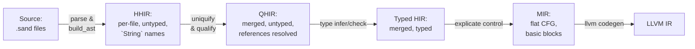

# the `sand` language & compiler implementation

a compiler for a small statically-typed expression language, structured as a sequence of IR transformations from parsed source to LLVM IR.

## the language

Sand is expression-oriented and statically typed. Every construct is an expression with a type.

```sand
def fib(n: Int): Int :=
  if n ≤ 1 then n else fib(n - 1) + fib(n - 2)

def main(): Int := {
    let mut x = 10;
    x = fib(x);
    println(x);
    0
}
```

its grammar is defined in [`grammar.pest`](grammar.pest), and the parser is autogenerated by [`pest`](https://pest.rs/).

### types
`Int`, `Bool`, `Unit`, user-defined enums (`type Ordering := Lt | Eq | Gt`), [OCaml-style polymorphic variants](hhttps://ocaml.org/manual/5.4/polyvariant.html) (without subtyping):
```sand
def check(x: Int): #one | #two | #other :=
    if x < 0 then #one else if x > 0 then #two else #other
```


### binding
`let mut? name(: Type)? = value`

variables are immutable by default, type annotations are optional.
```sand
let x = 10;
let y: Int = 20;
let mut z = x;
z = z + y;
```

### blocks
`{ stmt; stmt; expr }`
statements are executed in order, 
the final expression is the block's value; omitting it gives `Unit`.
```
Statement ::=
  | Declaration ("let" "mut"? identifier (":" type)? "=" expr ";")
  | Assignment (identifier "=" expr ";")
  | Expression (expr ";")
```

### pattern matching
`match expr { variant => expr; variant => expr; _ => expr }`

### indentation / spacing
does not matter.

### modules
Multi-file projects; `module::function` call syntax; module name == file name, unless explicitly specified by `module x;` (possibly multiple modules per file).

## IR layers

The compiler has five named IRs, each a distinct Rust type. 
**no IR is mutated in place**, each pass produces a new immutable AST.



---

### HHIR (Highest HIR) [`ir_types/hhir.rs`](lang/src/ir_types/hhir.rs)

the direct output of parsing: an untyped, per-file AST.
identifiers are represented as `String` names.
variable representation is a three-variant sum type:

```
HirVar = Decl(OriginalVarRef) -- a binding site (let x = ...)
       | Unqualified(String)  -- a use site, name not yet resolved
       | Uniq(UniqVar)        -- already uniquified (mid-pass state)
```

Similarly, function calls are unresolved strings: 
`HirFnCall = Local(String) | External { module, name }`.

Expressions carry source location (`Range`), and no types. 
If statements don't need an else branch yet. in later passes the else will be filled in with `Unit`.

One [`ProgramModule`](lang/src/ir_types/hhir.rs#L16) corresponds to one source file.

---

### QHIR (Qualified HIR) [`ir_types/qhir.rs`](lang/src/ir_types/qhir.rs)

- all modules are merged,
- `ProgramModule` is replaced by `Program { functions: Map<FunRef, Function> }`,
- **all variable occurrences are `UniqVar`**: opaque integers, one per binding site
- `HirVar` sum type is gone, `String` names no longer appear in the tree
- **all function calls are `FunRef` or `Intrinsic`**, string names have been checked against the global function table
- Constructor patterns in `match` are resolved to `(EnumRef, variant_idx)` pairs; bare `#tag` literals remain as `Tag { variant: String }` for the type checker to resolve.

---

### Typed HIR [`ir_types/typed_hir.rs`](lang/src/ir_types/typed_hir.rs)

the typed ast and final HIR.

- **`Expr` carries `ty: Ty`**, every node in the expression tree is annotated with its type.
- the `else` branch becomes mandatory, `if` without `else` is desugared to `if ... then ... else ()`, requiring the return type of `if` to be `Unit`.
- declaration types are resolved since type annotations are no longer optional in the tree.
- bare `Tag` expressions are eliminated, `#gt` in a context expecting `Ordering` becomes `Constructor { enum_ref, variant_idx: 2 }`.

---

### MIR Control Flow Graph [`ir_types/mir.rs`](lang/src/ir_types/mir.rs)

a CFG-based, register-machine IR, that somewhat mirrors LLVM IR. 
the expression tree is gone, each function becomes:
```rust
MirFunction {
  locals: Vec<LocalDecl>,  // all variables declared upfront
  blocks: Vec<BasicBlock>, // linear sequence of basic blocks
  entry:  BlockId,
}

BasicBlock {
  statements:  Vec<Statement>,
  terminator:  Terminator,     // Goto | Branch | Return | Unreachable
}
```

`Statement` is always `dst := rvalue`. 
`RValue` is a flat `BinaryOp`, `Call`, `Use(Operand)` with no nesting (ANF).
control flow is explicit via `Terminator::Branch { cond, then_bb, else_bb }`

---

### LLVM IR

generated from MIR via [`inkwell`](https://github.com/TheDan64/inkwell)

---

## passes (as functional programs)

### parsing & building the AST ([`passes/parse.rs`](lang/src/passes/parse.rs), [`passes/build_ast.rs`](lang/src/passes/build_ast.rs))

two steps treated as one, `pest` produces a parse tree, then `build_ast` folds it into HHIR. 
the fold is a structural recursion over the grammar's rule tree, mapping each grammar rule to its corresponding HHIR node.

---

### uniquify [`passes/qualify/uniquify/mod.rs`](lang/src/passes/qualify/uniquify/mod.rs)

`ProgramModule -> State ScopeStack (Result ProgramModule UniquifyError)`

the pass is a fold over `Expr` that carries a mutable scope stack as state. The scope stack is `Vec<Map<String, UniqVar>>`, with `enter_scope`/`exit_scope`, bracketing each block and function body. Binding sites (`HirVar::Decl`) generate a fresh `UniqVar` and push it; use sites (`HirVar::Unqualified`) look up the innermost binding.

---

### Qualify [`passes/qualify/mod.rs`](lang/src/passes/qualify/mod.rs)

Resolves `HirFnCall::Local(String)` and `HirFnCall::External { module, name }` to global `FunRef` indices by looking up the global function table in `CompileCtx`. Also resolves constructor names to `(EnumRef, variant_idx)`. Merges the per-file `ProgramModule` values into a flat `Program`.

---

### Type checking [`passes/type_ast/`](lang/src/passes/type_ast/)

bidirectional type checking[^1], split across two mutually recursive functions:

- **`infer(ctx, env, expr) -> Result<TypedExpr, Error>`**: synthesises a type bottom-up. The environment `TypeEnv = Map<UniqVar, (Ty, IsMutable)>` is threaded as an immutable reader

- **`check(ctx, env, expr, expected) -> Result<TypedExpr, Error>`**: verifies an expression against a known type, propagating it into sub-expressions. used to resolve bare `#tag` literals, and to propagate the expected type through `if`-branches and block tails

`check` delegates to `infer` for all forms it doesn't handle specially, then verifies the synthesised type matches the expected one

Block typing is a monadic fold (`try_fold` = `foldM` over `Result`):
```rust
statements.iter().try_fold((vec![], env.clone()), |(mut stmts, mut env), stmt| {
    stmts.push(infer_statement(ctx, &mut env, stmt)?);
    Ok((stmts, env))
})
```
each statement extends the environment, threading it into the next

`CompileCtx` is passed as an immutable reference throughout (a ReaderM environment holding global tables (function signatures, enum definitions, variable names)). 

the "mutable" `TypeEnv` is local to each function body, cloned at each branch point to preserve the scoping invariant.
it wraps an `im::HashMap`[^2] (a persistent immutable hash map) and is cheaply cloneable. "mutable" serves just as a rust annotation, not as actual runtime mutable state.

match exhaustiveness is checked by collecting covered variant indices into a `Set` and comparing against the total variant count.


[^1]: https://www.cis.upenn.edu/~bcpierce/papers/lti-toplas.pdf
[^2]: https://docs.rs/im/latest/im/

---

### Explicate Control [`passes/explicate_control/`](lang/src/passes/explicate_control/)

`TypedProgram -> MirProgram`

a continuation-passing lowering of the expression tree into basic blocks.
`FnCx` accumulates blocks and locals as mutable state, functioning as `StateT`.
this code is adapted (effectively 1-1) from the explicate control assignment of CS4555 Compiler Construction.

---

## Project Layout

```tree
.
├── Cargo.toml      // workspace root
├── README.md
├── examples/       // .sand programs for showcase & testing
├── grammar.pest    // parser grammar
├── lang
│   ├── Cargo.toml
│   └── src
│       ├── analysis/     // reused expression analysis from CS4555 Compiler Construction
│       ├── bin/          // small utilities for debugging & visualization
│       ├── castles/      // project discovery & initialization, for multi-file compilation
│       ├── compiler
│       │   ├── context
│       │   │   ├── compile.rs  // CompileCtx, the main state during compilation
│       │   │   ├── mod.rs
│       │   │   └── project.rs  // ProjectCtx, the state for a single project
│       │   ├── diagnostics/    // diagnostics & error formatting
│       │   ├── mod.rs
│       │   ├── structure
│       │   │   ├── debug.rs      // source code `Pos` and `Range`
│       │   │   ├── enums.rs      // `EnumDef`
│       │   │   ├── functions.rs  // `FunRef` etc
│       │   │   ├── mod.rs
│       │   │   ├── projects.rs   // `CodeModule`, `CodeFile`, `ModuleRef`
│       │   │   └── variables.rs  // `UniqVar` etc
│       │   └── tests/
│       ├── core.sand             // core library, included in every compilation
│       ├── interpreter
│       │   ├── mir.rs        // an interpreter for the MIR
│       │   ├── mod.rs
│       │   └── typed_hir.rs  // an interpreter for the typed HIR
│       ├── ir_types
│       │   ├── display/      // pretty-printing for each IR
│       │   ├── hhir.rs       // the first high-level IR (AST)
│       │   ├── mir.rs        // the middle-level IR (control flow graph)
│       │   ├── mod.rs
│       │   ├── qhir.rs       // the second high-level IR (qualified AST)
│       │   └── typed_hir.rs  // the final HIR (typed AST)
│       ├── lang
│       │   ├── intrinsics.rs // intrinsics for the language (e.g. println)
│       │   ├── mod.rs
│       │   ├── ops.rs     // operators (`Bop`, `Uop`, `CompOp`, etc)
│       │   └── types.rs   // the `Ty` enum
│       ├── lib.rs  // `SandLangError` and `compile_hir`
│       ├── passes
│       │   ├── build_ast.rs        // build the AST from pest's output
│       │   ├── explicate_control/ 
│       │   ├── llvm_codegen.rs
│       │   ├── mod.rs
│       │   ├── ownership           // fn check(ctx, TypedProgram) -> Result<TypedProgram, OwnershipCheckError>
│       │   ├── parse.rs
│       │   ├── qualify
│       │   │   ├── error.rs
│       │   │   ├── mod.rs          // combine modules & qualify variable and function names
│       │   │   └── uniquify        // uniquify variable names & scope check
│       │   └── type_ast            // bidirectional type checking
│       │       ├── check.rs        // check(qhir::Expr == ty) -> Result<typed_hir::Expr, TypeError>
│       │       ├── errors.rs
│       │       ├── infer.rs        // infer(qhir::Expr) -> Result<typed_hir::Expr, TypeError>
│       │       └── mod.rs
│       └── util/
├── sand-cli/    // compiler CLI
├── sand-lsp/    // language server binary
├── tests/       // test suite
└── treesitter/  // tree-sitter grammar for syntax highlighting

45 directories, 174 files
```
